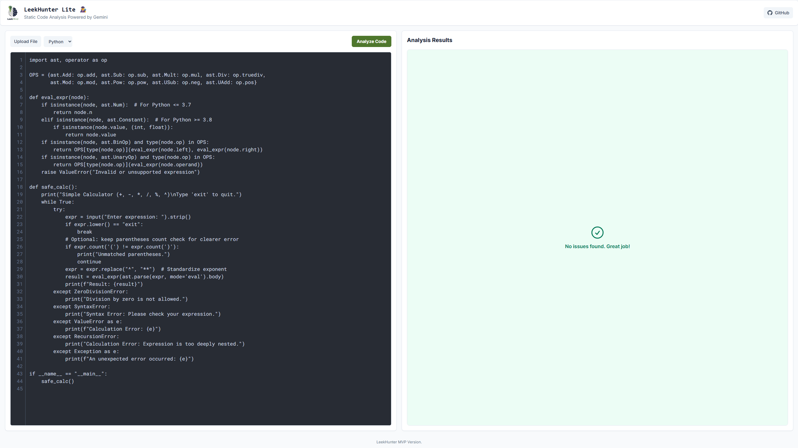

# **LeekHunter Lite – Quick Scan**

**A LeekMind Project by Ahmad Shatnawi**

LeekHunter Lite is a lightweight **static code analysis web tool** developed under **LeekMind**. Users can paste Python or C code and instantly receive actionable insights about potential bugs, bad practices, and logical issues — all without executing the code.

This project is a **minimal viable product (MVP)** demonstrating AI-powered code review in a simple, accessible web interface.

---

## **Demo Screenshot**

<p><a href="#" onclick="document.getElementById('video-gallery').style.display='block'; return false;">
  
</a></p>

<details>
<summary>Demo Videos</summary>

### Discount Bug in C
<video width="960" controls>
  <source src="DEMO/Demo_videos/Dbug.c.mp4" type="video/mp4">
  Your browser does not support the video tag.
</video>

### Discount Bug in Python
<video width="960" controls>
  <source src="DEMO/Demo_videos/Dbug.py.mp4" type="video/mp4">
  Your browser does not support the video tag.
</video>

### Simple Index and Malloc Error
<video width="960" controls>
  <source src="DEMO/Demo_videos/Simple_index_malloc.mp4" type="video/mp4">
  Your browser does not support the video tag.
</video>

### Error
<video width="960" controls>
  <source src="DEMO/Demo_videos/Errors.mp4" type="video/mp4">
  Your browser does not support the video tag.
</video>

</details>

---

## **Features**

* **Static Analysis Only:** Quickly detects syntax errors, type issues, and potential logic bugs.
* **Supports Python & C:** Analyze multiple languages.
* **Dynamic Results Table:** Displays issues with line number, severity, message, and suggested fix.
* **Clean Interface:** Simple and responsive web interface.
* **Quick Scan MVP:** Fast AI-powered feedback without executing code (safe and reliable).

---

## **Project Structure**

```
LeekHunter-Lite/
│
├── app.py                  # Flask backend
├── LICENSE
├── README.md
├── requirements.txt        # Dependencies
├── DEMO/
│   ├── Demo_videos/
│   │   ├── Dbug.c.mp4
│   │   ├── Dbug.py.mp4
│   │   ├── Errors.mp4
│   │   └── Simple_index_malloc.mp4
│   ├── discount_bug.c
│   ├── discount_bug.py
│   ├── hello.cpp
│   ├── list_index.py
│   ├── memory_leak.c
│   ├── safe_calc.png
│   └── safe_calc.py
├── static/
│   ├── leekmind-logo.jpg   # Logo / branding
│   ├── main.js             # Frontend JS
│   └── style.css           # Stylesheet
├── templates/
│   └── index.html          # Frontend HTML
└── tests/
    ├── discount_bug.c
    ├── discount_bug.py
    ├── division_bug.py
    ├── list_index.py
    ├── logic_bug.c
    └── memory_leak.c
```

---

## **Installation & Setup**

1. **Clone the repository**

```bash
git clone https://github.com/ahmadsh2007/CS50-Final-Project-LeekHunter-Lite.git
cd CS50-Final-Project-LeekHunter-Lite
```

2. **Install dependencies**

```bash
pip install -r requirements.txt
```

3. **Set your Google Gemini API key**

```bash
export GEMINI_API_KEY="YOUR_GOOGLE_GENAI_API_KEY"
# On Windows (cmd):
# set GEMINI_API_KEY="YOUR_GOOGLE_GENAI_API_KEY"
```

> ⚠️ **Security Note:** Never hardcode your API key in production.

> 💡 **Free API Key:** Users can obtain a free API key for the Gemini Flash version for testing purposes. This allows you to try the static analysis without any cost.

4. **Run the Flask server**

```bash
python app.py
```

5. **Open in your browser**

Visit [http://127.0.0.1:5000](http://127.0.0.1:5000) and start analyzing code.

---

## **Usage**

1. Paste your Python or C code into the editor.
2. Select the programming language from the dropdown.
3. Click **Analyze Code**.
4. Review the table for any issues, including **line number**, **severity**, **message**, and **suggested fix**.

If no issues are found, a friendly message is displayed: *"No issues found. Great job!"*

---

## **Unit Testing (Optional)**

You can add unit tests to validate the `/analyze` endpoint in the future. Python's `unittest` framework can be used for this purpose.

Example of running tests (once implemented):

```bash
python -m unittest tests/test_app.py
```

---

## **Technologies Used**

* **Backend:** Python, Flask
* **AI Analysis:** Google Gemini API (`gemini-2.5-flash-lite`)
* **Frontend:** HTML, CSS, JavaScript (Vanilla JS)
* **Styling:** Custom CSS inspired by One Dark Pro theme
* **Testing:** Optional Python `unittest`

---

## **Future Improvements**

* Add **Deep Scan** with optional code execution for runtime error detection.
* Expand **language support** beyond Python & C.
* Integrate **file uploads** for analyzing large projects.
* Enhance **UX** with syntax highlighting and collapsible error messages.

---

## **License**

This project was developed by **LeekMind** as part of the CS50 final project. Please **do not use my API key**.

---

## **Contact**

**Ahmad Shatnawi – LeekMind**

* Email: [ahmad@leekmind.com](mailto:ahmad@leekmind.com)
* GitHub: [https://github.com/ahmadsh2007](https://github.com/ahmadsh2007)
